<p align="center">
  
</p>

<p align="center">
  <a href="https://www.linkedin.com/in/daniel-stefan-reis/"></a>
  <a href="https://github.com/innexosistemas-lang/Offsec-labs"></a>
  
</p>

```console
daniel@redteam-lab:~$ cat profile.txt
  role      Estudante de Cibersegurança — PUC-Campinas (Escola Politécnica)
  focus     Penetration Testing · Web AppSec · Linux Privilege Escalation
  method    Recon → Enumeração → Exploração → Pós-exploração → Relatório
  lab       KVM/libvirt isolado (Kali · Metasploitable2 · Windows 11) + VPS com alvos em Docker
  goal      Primeira posição em segurança ofensiva / defensiva (estágio ou júnior)
```

### `> about`

Trabalho cada projeto como um **engajamento real de pentest**: escopo definido, metodologia, evidências reproduzíveis e recomendações de remediação. O objetivo não é só explorar, mas entregar um relatório que um time técnico consiga usar para corrigir.

Todos os testes são feitos em **ambientes próprios ou expressamente autorizados**.

### `> focus areas`

| Área | O que pratico |
|---|---|
| **Reconhecimento** | OSINT, enumeração de serviços, mapeamento de superfície de ataque |
| **Web AppSec** | OWASP Top 10, testes manuais com Burp Suite, falhas de autenticação e injeção |
| **Exploração de infraestrutura** | Serviços legados, cadeias de exploração com Metasploit, cracking de hashes |
| **Pós-exploração** | Escalação de privilégios em Linux, persistência e coleta de evidências |
| **Hardening & Blue Team** | Hardening de VPS, análise de logs e tráfego (tcpdump / Wireshark) |
| **Reporting** | Relatórios técnicos com severidade, evidências e plano de remediação |

### `> toolkit`

<p>
  
  
  
  
  
  
  
  
</p>
<p>
  
  
  
  
  
  
</p>

### `> featured engagement`

<a href="https://github.com/innexosistemas-lang/Offsec-labs">
  
</a>

**Offsec-labs** — portfólio de segurança ofensiva: reconhecimento, exploração web, escalação de privilégios, OWASP Top 10 e hardening de VPS, cada projeto documentado no formato de relatório de pentest.

### `> certifications`

| Status | Certificação |
|---|---|
| ✔ Concluída | **Segurança em Linux na Era da IA** — IBSEC (2026) |
| ◐ Em andamento | **Google Cybersecurity Professional Certificate** — Coursera |
| ○ Próximos passos | **ISC² Certified in Cybersecurity (CC)** → **CompTIA Security+** |

### `> activity`

<p>
  
  
</p>

---

<p align="center">
  <sub><code>// conhecimento ofensivo a serviço da defesa</code></sub>
</p>
